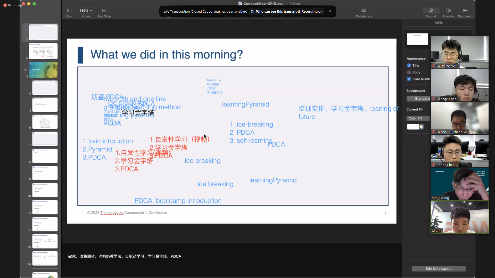
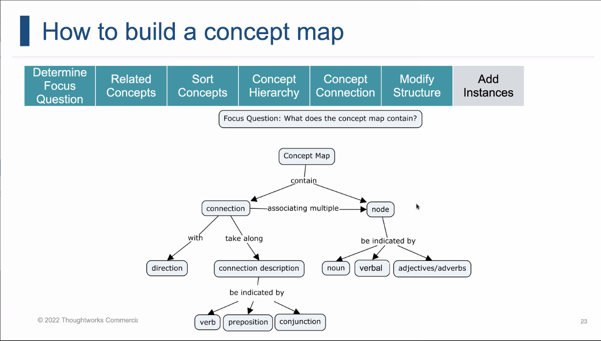

# Day1

## 1.Learning Pyramid

学习金字塔

## 2.PDCA

P：plan
D：do
C：check
A：action

## 3.Concept Map

connection,node,description

## 4.ORID

Objective：The Objective Level of Thinking：这个方法就是通过引导的方法，对团队成员都着眼于客观事实，引导师让大家先说看到了什么、听到了什么，一方面是比较容易让大家回答，参与，同时让大家从事实入手看问题。

Reflective：The Reflective Level of Thinking：引导师会问大家对此事情的感受是怎么的？比较适合让人们打开感性的一面？多用来描述心情，如“喜、怒、哀、乐”等。

Interpretive：The Interpretive Level of Thinking ：思考这件事带给我们的思考、意义、启发是什么？

Decisional：The Decisional Level of Thinking：给我们带来的行动是什么？未来我要怎么做？

## problem

concept map:The concerns don't quite fit the map;Unclear division of labor
