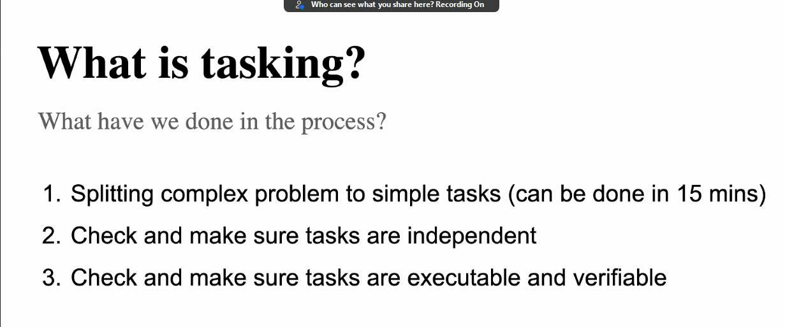
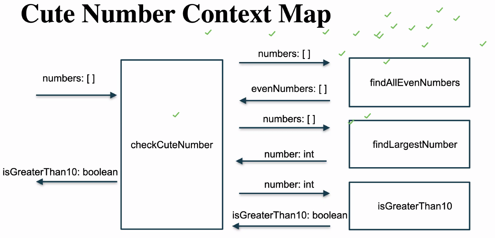
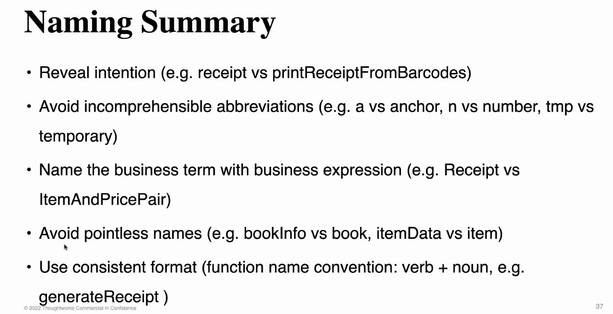
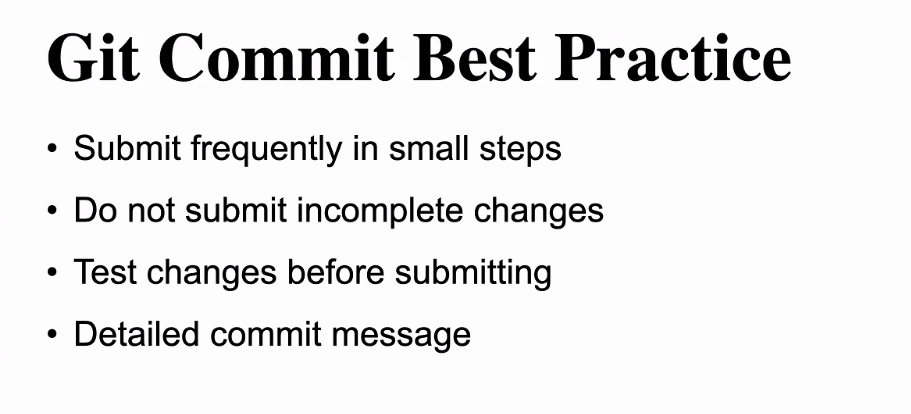
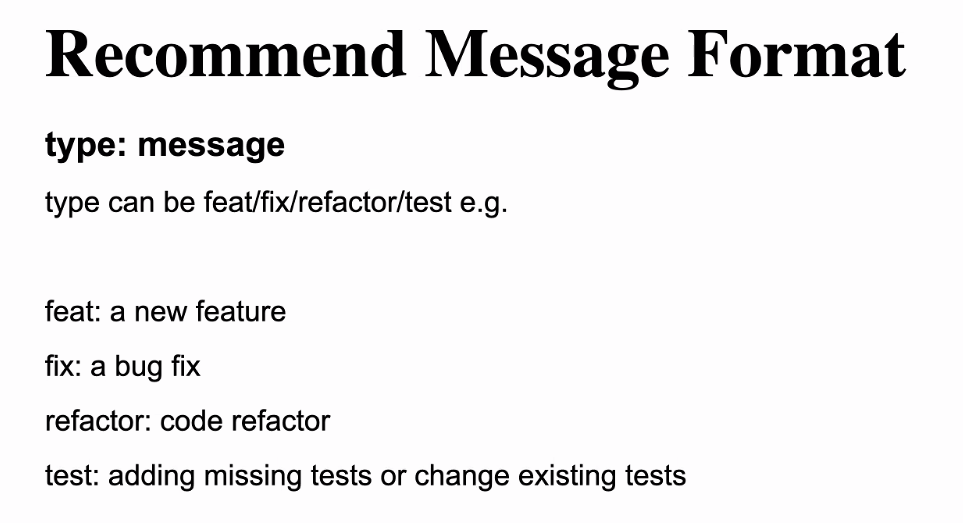

# Day02

## Tasking

把目标定义分为5个步骤：1） 范围确定 2）目标分解 3）优先级确定 4） 可执行化任务分解 5）进入跟踪系统。

塞大象分几步

1. Splitting complex problem to simple tasks.
2. Check and make sure tasks are independent.
3. Check and make sure tasks are xecutable and verifiable.

when: when we meet a complex problem we can use tasking to split the problem into many small problems

attention:should list the input and output

Context Map

## Naming

verb+noun,Hump naming,tell others what does the fuction do clearly.

## Git

basic git command

