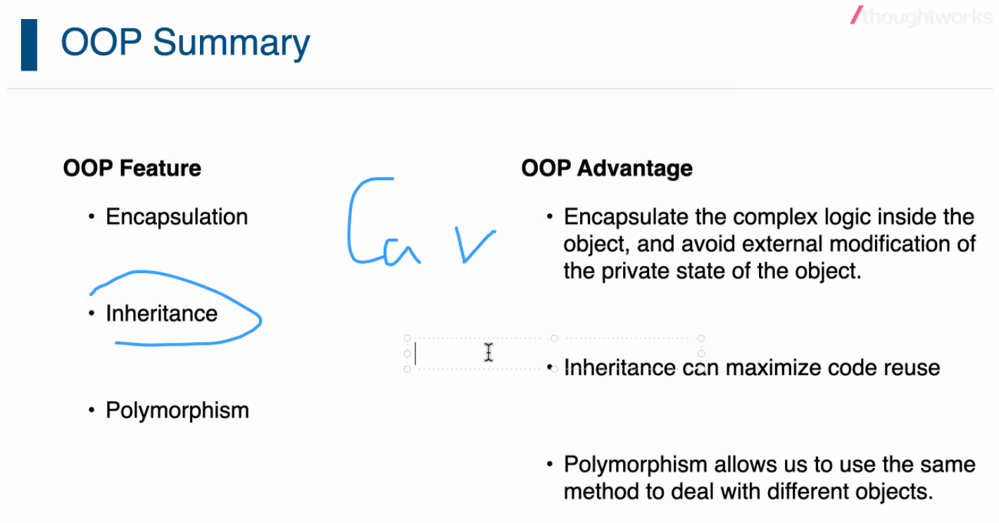

# Day03

## CodeReview

What?

Code review is a software quality assurance activity.

This activity need person to check a program by viewing and reading source code.

At least one reviewer who is not the code author.

How?

Code review file by file

Code review commit by commit

Benefit

Share context with your mates

Learn from others

Find the potential issue from source code

Rules

1. Learning by Challenge
2. Learning by Sharing
3. Focus on the code and commits
4. Ask more questions
5. Set time box per repo
6. Summary and Record the Good Points and Questions

Attention

1. 先介绍项目需求
2. 项目目录结构

## Java Stream

1. forEach
2. filter
3. distinct
4. map
5. reduce

## Java OOP

1. Encapsulation
2. Inheritance
3. Polymorphism

