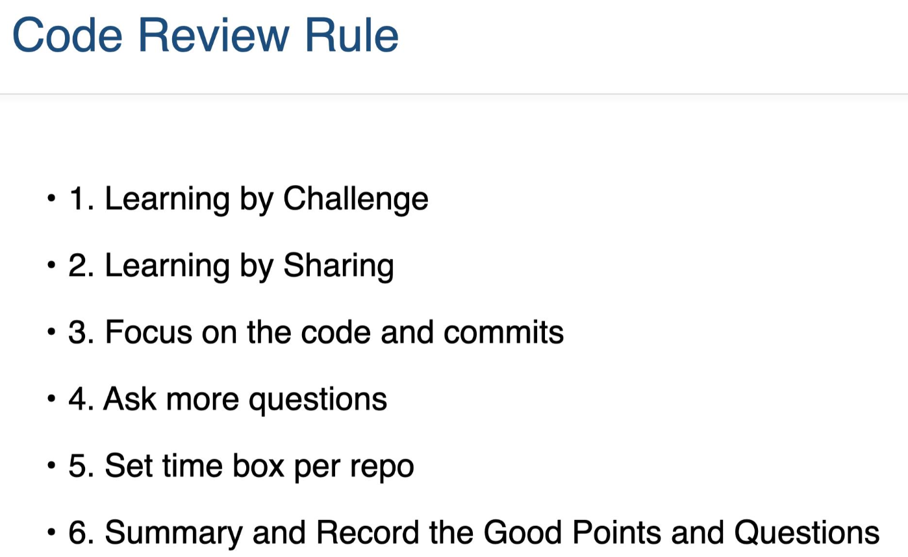

# Day03

## CodeReview

What?

How?

Benefit

Rules

Attention

1. 先介绍项目需求
2. 项目目录结构

## Java Stream

1. forEach
2. filter
3. distinct
4. map
5. reduce

## Java OOP

1. Encapsulation
2. Inheritance
3. Polymorphism
