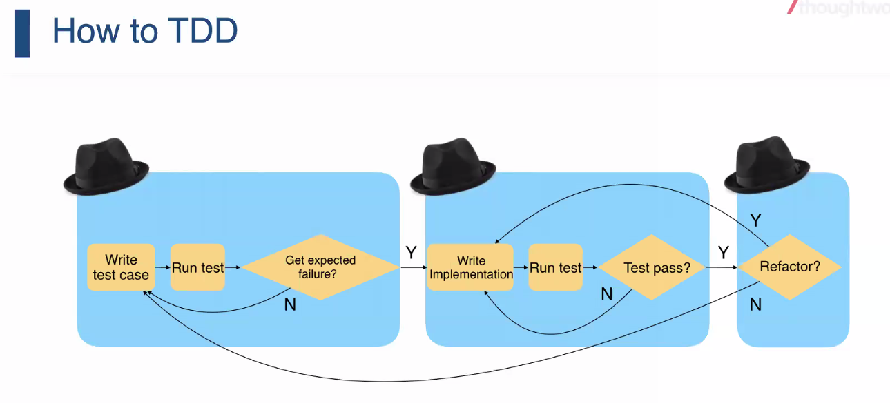
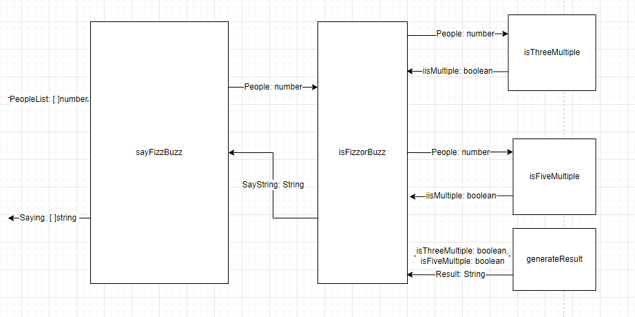
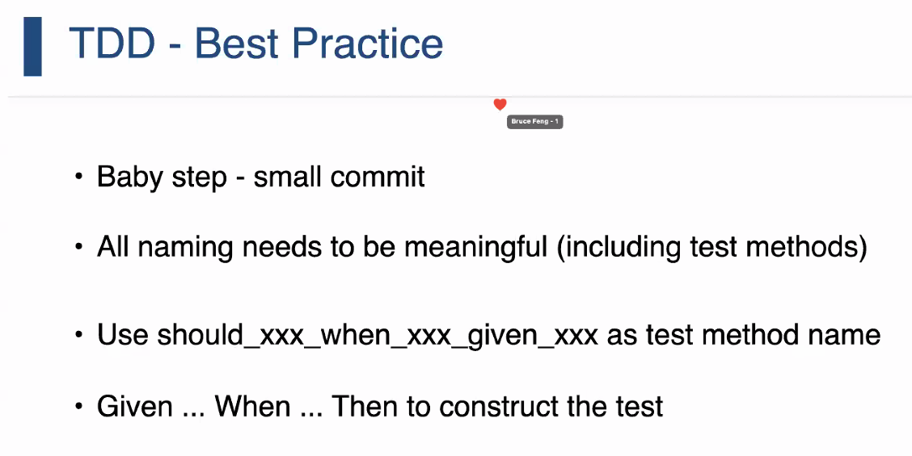
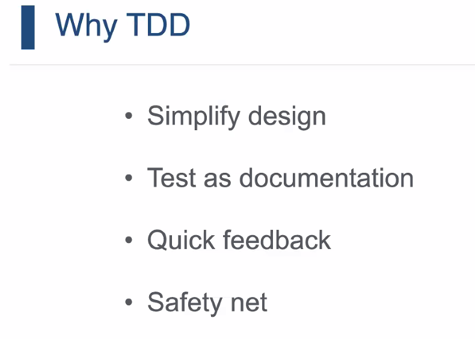
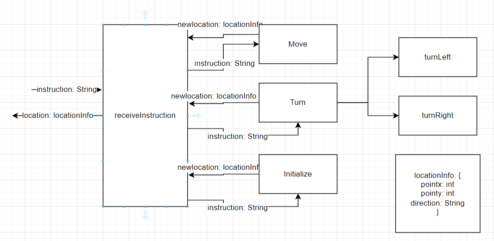
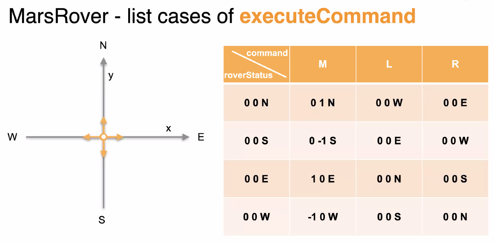

# Day04

## Code Review

about 1.5 hour

## TDD(Test-driven development)

How to TDD

FizzBuzz
Context Map

cases
Given something when fuction Then result

Why?

1. Simplify design
2. Test as documentation
3. Quick feedback
4. Safety net

Mars

