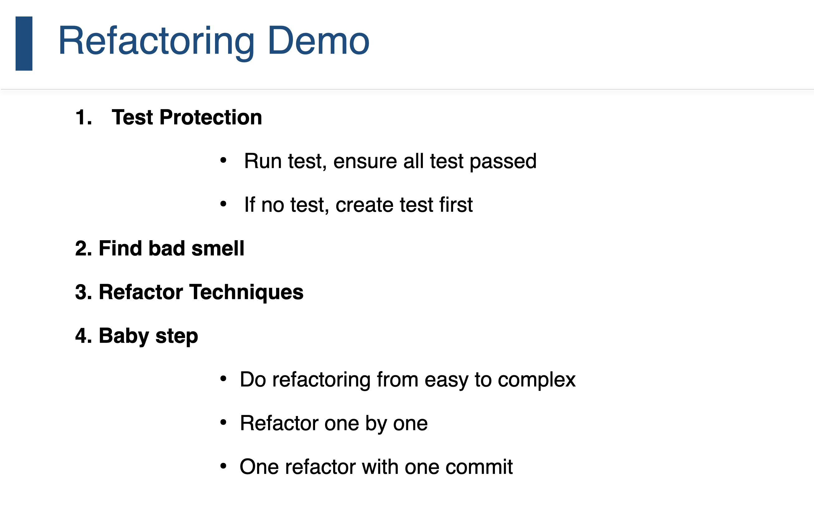

# Day06

## Design Pattern

1. 策略模式
2. 命令模式
3. 观察者模式

## Retro

## Refactor

###  Code Smell

### Refactoring Techniques

1. Extract
2. Inline
3. Move
4. Organize
5. Rename

## Test Protection

When?

1. Rule of Three
2. New Features
3. BUg Fix
4. Code Review

How?

1. Run Test
2. Refactor
3. Test again
4. Commit

