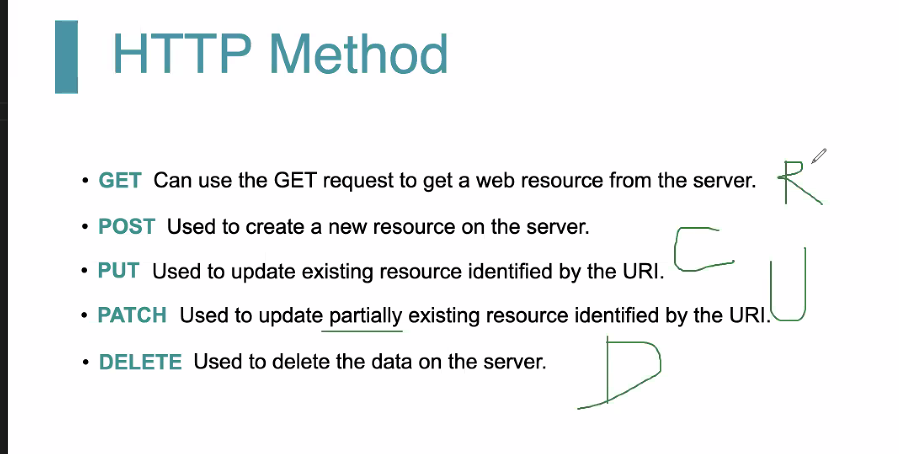
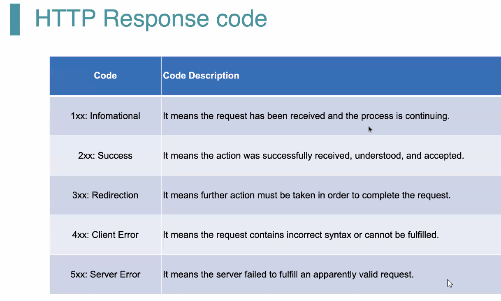
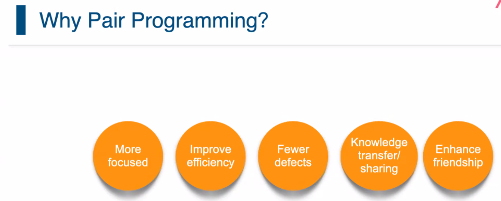
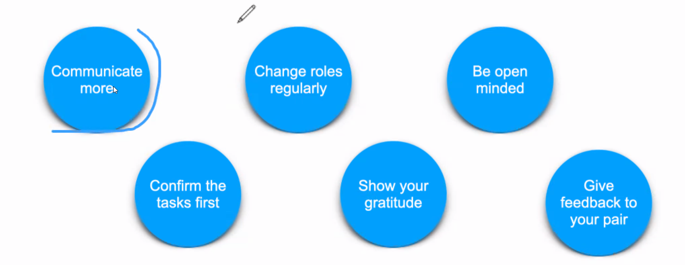

# Day07

## Concept Map :TDD

## HTTP

1. 超文本传输协议
2. URI: Scheme, host, port, path, query, fragment
3. URL
4. HTTP Method

5. Status Code

6. Pair Programming
Why?

PingPong
navigator-Driven

## SpringBoot

@RestControler
@RequestMapping
@GetMapping
@PostMapping
@AutoWire

Restful
