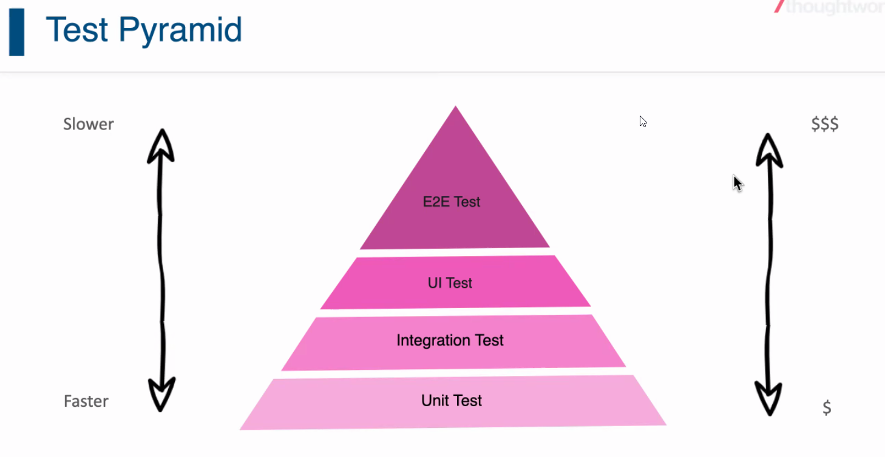

# Day08

## CodeReview

1. delete return 204/No Content status code.
2. create return id and 201.
3. Integer instead of int when receive params

## MockMVC

Spring提供的test

## SpringArchitecture

Controller, Service, Dao/Repository

## Test Pyramid

## Exception
